<div align="center">


# 🐾 PetConnect

### **Find Your Forever Friend**

*A modern pet adoption platform that bridges the gap between shelters, independent rescuers, and loving families — making adoption seamless, digital, and transparent.*

<br>

[](https://www.djangoproject.com/)
[](https://www.python.org/)
[](https://www.mysql.com/)
[](https://www.sqlite.org/)

[](LICENSE)
[]()
[]()
[]()

<br>

**[Overview](#-overview)** • **[Features](#-features)** • **[Screenshots](#-screenshots)** • **[Tech Stack](#%EF%B8%8F-tech-stack)** • **[Installation](#-getting-started)** • **[Roadmap](#%EF%B8%8F-roadmap)**

</div>

<br>

---

<br>

## 📖 Overview

**PetConnect** is a full-stack web application built with **Django** that connects pet owners and shelters with people looking to adopt. Owners list their pets with rich photo galleries; adopters browse, filter, and submit adoption requests with a personal message — and owners approve or reject those requests from a real-time dashboard.

Every image uploaded is **automatically converted to WebP** to keep the platform fast, and the entire interface is built with **hand-crafted CSS** — no Bootstrap, no Tailwind, no UI kit. Just a clean, custom design system.

<br>

<table>
<tr>
<td width="33%" align="center">

### 🎯
**Dual-Role System**

Separate, tailored experiences for **Adopters** and **Pet Owners**

</td>
<td width="33%" align="center">

### ⚡
**Optimized by Design**

Aggregated queries, WebP compression, and server-side pagination

</td>
<td width="33%" align="center">

### 📱
**Fully Responsive**

Custom CSS that adapts beautifully from mobile to desktop

</td>
</tr>
</table>

<br>

---

<br>

## ✨ Features

### 👤 For Adopters

| Feature | Description |
|:--|:--|
| 🔍 **Browse & Discover** | Explore all available pets with a paginated, card-based gallery |
| 🐕 **Category Filtering** | Filter instantly by Dogs, Cats, Birds, or Others |
| 📸 **Rich Pet Profiles** | Multi-image galleries with breed, age, and location details |
| 💌 **Adoption Requests** | Submit a personalized message explaining why you'd be a great match |
| 📊 **Request Tracking** | Live dashboard showing Pending / Approved / Rejected counts |
| 🔐 **Secure Auth** | Registration, login, and email-based password recovery |

<br>

### 🏠 For Pet Owners

| Feature | Description |
|:--|:--|
| 📋 **Owner Dashboard** | Single-page dashboard with sidebar navigation and live statistics |
| ➕ **List a Pet** | Add pets with species, breed, age, location, and multiple photos |
| 🖼️ **Image Carousel** | Browse through every photo of each listed pet |
| 📬 **Incoming Requests** | Full table of all adoption requests across your pets |
| ⚡ **AJAX Approvals** | Approve or reject requests instantly — no page reload |
| 🔄 **Auto Status Sync** | Approving a request automatically marks the pet as *Adopted* |

<br>

### 🛠️ Under the Hood

```
Custom User model with role-based authorisation (Adopter / Owner)
Every owner-only view guarded server-side by an @owner_required decorator
Object-level ownership checks on delete and approve/reject actions
Database-level uniqueness constraint on (pet, adopter) adoption requests
Automatic WebP image conversion, resizing and compression (quality 85)
Server-side upload validation: type, size and count limits
Single-query category aggregation using Count + Q filters
select_related / prefetch_related throughout — no N+1 queries
Server-side filtering and pagination on browse and dashboard views
Email-based password reset with no account enumeration
Zero external CDNs — every asset is self-hosted
37 automated tests covering authorisation, adoption flow and rendering
Environment-based configuration with python-decouple
Production security headers auto-enabled when DEBUG=False
```

<br>

---

<br>

## 📸 Screenshots

> 💡 **Note:** Drop your screenshots into `docs/screenshots/` using the exact filenames shown below and they will render automatically.

<br>

### 🏠 Home Page

<div align="center">

<!-- ➜ docs/screenshots/home.png -->
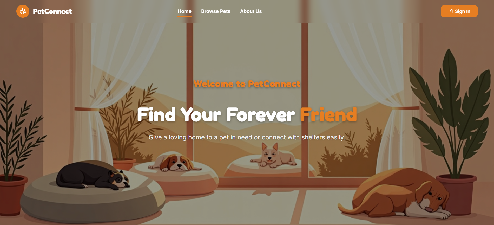

*Fullscreen hero, category cards with live counts, featured pets, and "How It Works"*

</div>

<br>

### 🔎 Browse Pets

<div align="center">

<!-- ➜ docs/screenshots/browse-pets.png -->
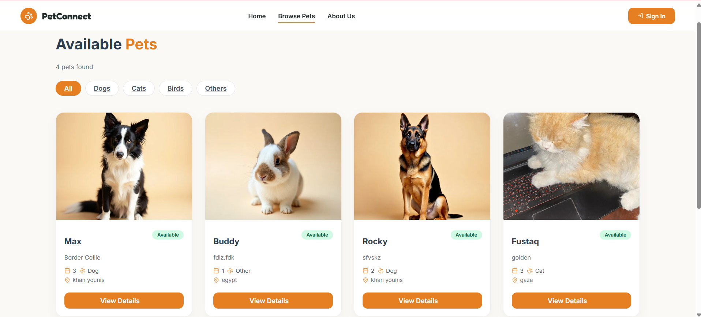

*Paginated pet gallery with category filter buttons*

</div>

<br>

### 🐕 Pet Details

<div align="center">

<!-- ➜ docs/screenshots/pet-detail.png -->
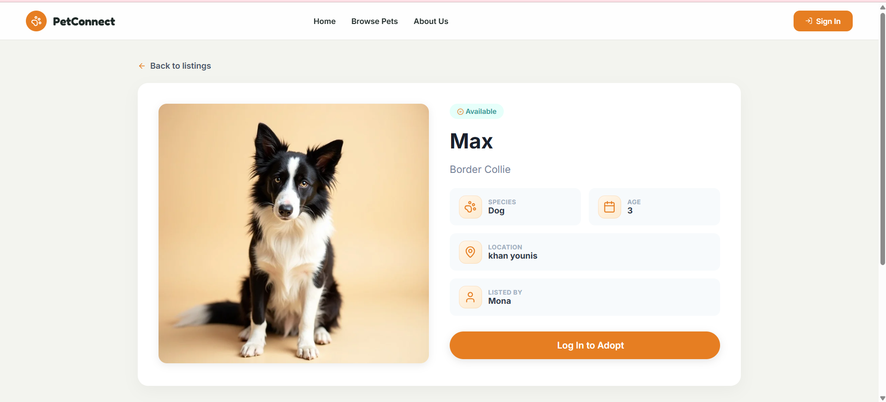

*Image gallery, specification grid, and adoption call-to-action*

</div>


<br>

### 📊 Owner Dashboard — Overview

<div align="center">

<!-- ➜ docs/screenshots/dashboard-overview.png -->
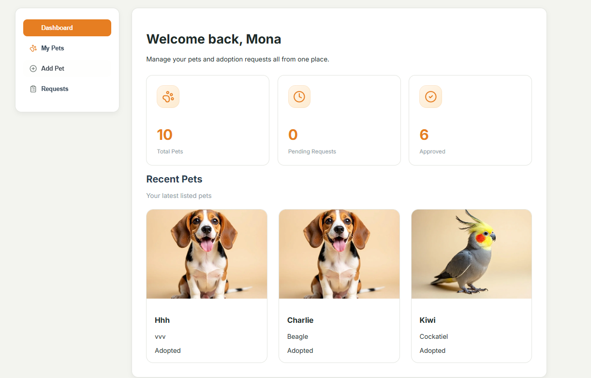

*Welcome card, statistics tiles, and recently listed pets*

</div>

<br>

### 🐾 Owner Dashboard — My Pets

<div align="center">

<!-- ➜ docs/screenshots/dashboard-my-pets.png -->
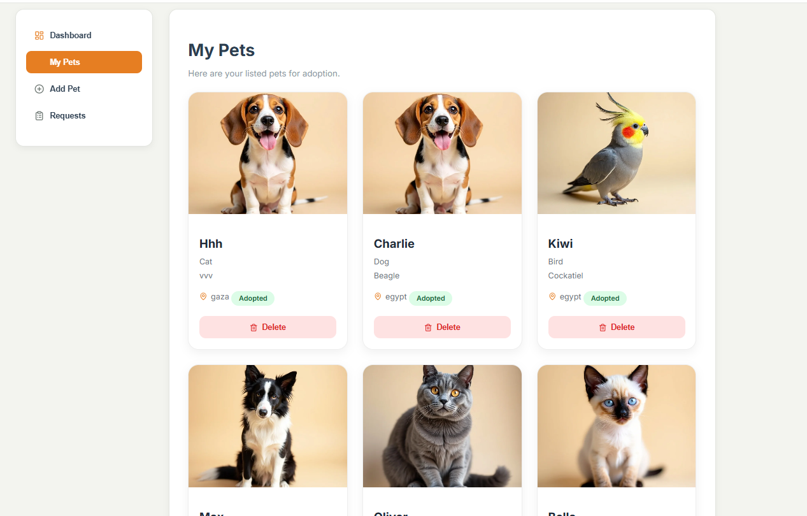

*Pet cards with multi-image carousels and pagination*

</div>

<br>

### ➕ Owner Dashboard — Add Pet

<div align="center">

<!-- ➜ docs/screenshots/dashboard-add-pet.png -->
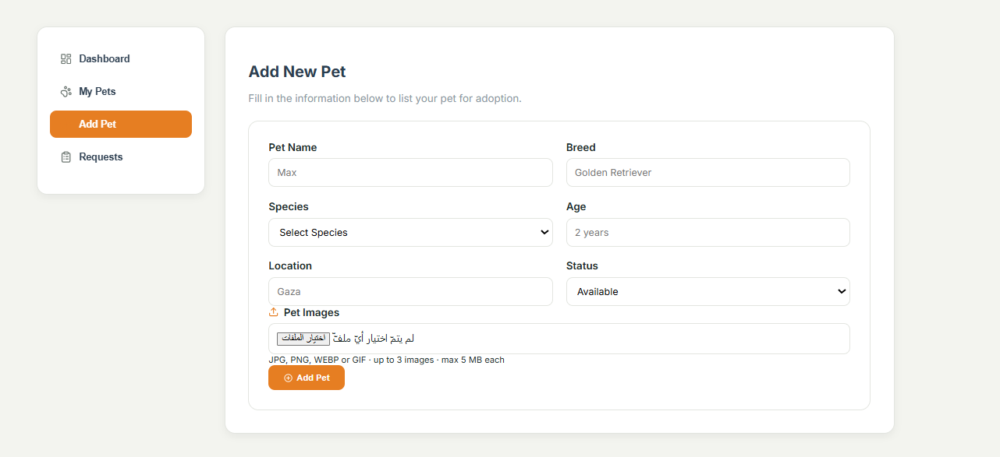

*Multi-field listing form with multi-image upload*

</div>

<br>

### 📬 Owner Dashboard — Adoption Requests

<div align="center">

<!-- ➜ docs/screenshots/dashboard-requests.png -->
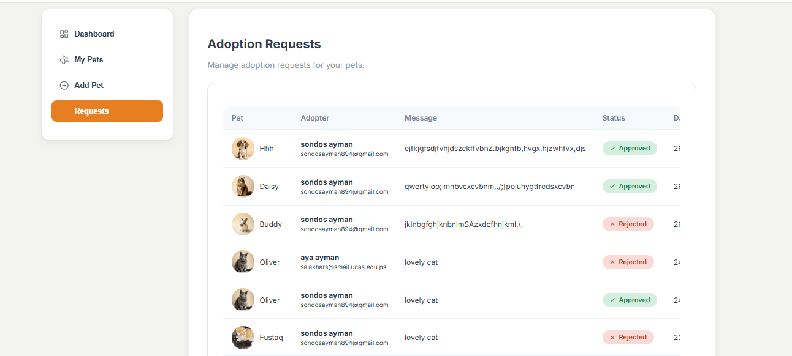

*Requests table with instant AJAX approve / reject actions*

</div>

<br>

### 📋 My Requests (Adopter)

<div align="center">

<!-- ➜ docs/screenshots/my-requests.png -->
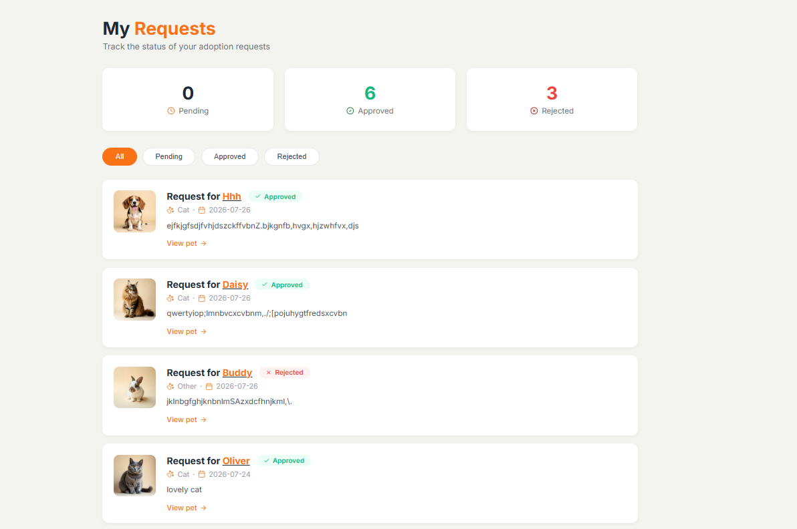

*Status statistics with filterable request cards*

</div>

<br>

### 🔐 Sign In

<div align="center">

<!-- ➜ docs/screenshots/login.png -->
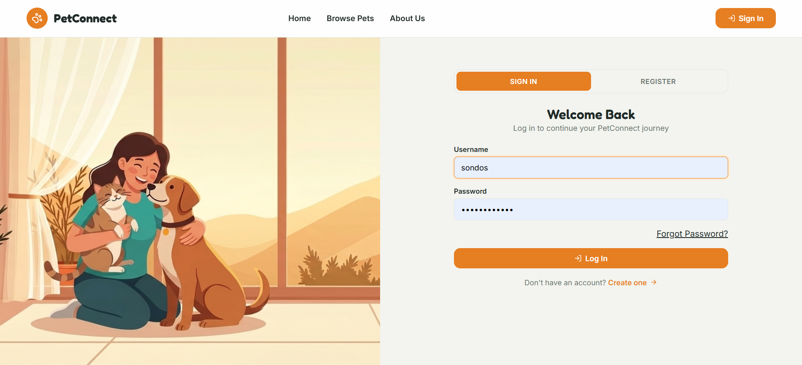

*Split-screen layout with hero imagery and tabbed auth card*

</div>

<br>

### 📝 Register

<div align="center">

<!-- ➜ docs/screenshots/register.png -->
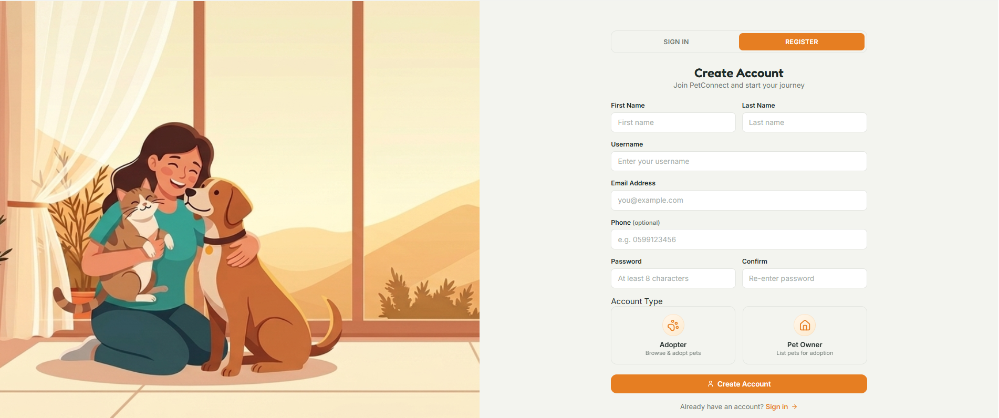

*Full registration form with visual role selection cards*

</div>

<br>

### 🔑 Forgot Password

<div align="center">

<!-- ➜ docs/screenshots/forgot-password.png -->
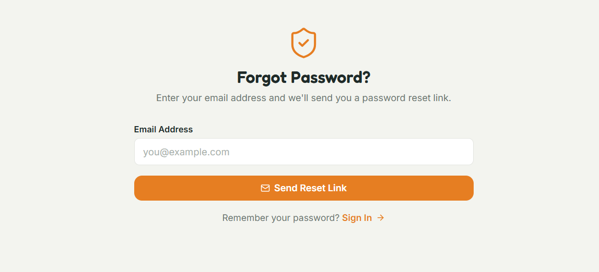

*AJAX-powered reset link request with inline feedback*

</div>

<br>

### ℹ️ About Us

<div align="center">

<!-- ➜ docs/screenshots/about.png -->
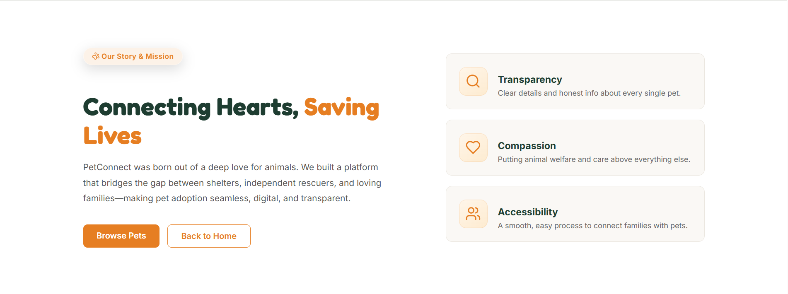

*Mission statement, core values, and platform story*

</div>

<br>

### 📱 Responsive / Mobile View

<div align="center">

<!-- ➜ docs/screenshots/mobile.png -->
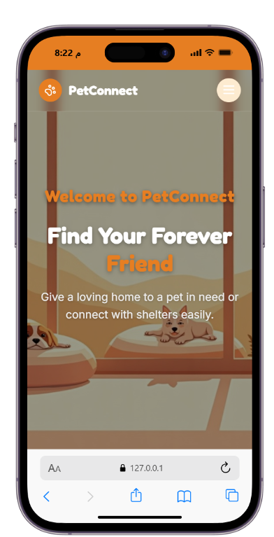

*Collapsible navigation and adaptive layouts on small screens*

</div>

<br>

---

<br>

## 🛠️ Tech Stack

<div align="center">

| Layer | Technology |
|:--|:--|
| **Backend** | Django 6.0.7 · Python 3.13+ |
| **Database** | MySQL 8.0 (development) · SQLite 3 (deployment) |
| **Frontend** | Django Templates · Vanilla JavaScript (ES6) · Custom CSS3 |
| **Image Processing** | Pillow — automatic WebP conversion &amp; resizing |
| **Configuration** | python-decouple — environment-based settings |
| **Email** | Django SMTP backend (Gmail) |
| **Typography** | Fredoka (display) · Inter (body) |
| **Icons** | Self-hosted inline SVG set via a custom `` template tag |

</div>

<br>

### 🎨 Design System

The entire interface runs on a single set of CSS custom properties:

<div align="center">

| Token | Value | Preview |
|:--|:--|:--:|
| `--color-primary` | `#e67e22` |  |
| `--color-primary-dark` | `#d35400` |  |
| `--color-primary-soft` | `#fdebd0` |  |
| `--color-bg` | `#f3f4ef` |  |
| `--color-text` | `#1f2a28` |  |
| `--color-success-text` | `#1e7d43` |  |
| `--color-error-text` | `#b3261e` |  |

</div>

<br>

---

<br>

## 🗂️ Project Structure

```
petconnect_platform/
│
├── 📁 petconnect/                  # Project configuration
│   ├── settings.py                 # Environment-driven settings
│   ├── urls.py                     # Root URL configuration
│   ├── wsgi.py  /  asgi.py         # Deployment entry points
│
├── 📁 petcare/                     # Main application
│   ├── 📁 models/                  # Models split by domain
│   │   ├── user.py                 # Custom User + UserManager
│   │   ├── pet.py                  # Pet + PetImage (WebP conversion)
│   │   └── AdoptionRequest.py      # Adoption request workflow
│   │
│   ├── 📁 templates/               # 15 Django templates
│   │   ├── base.html               # Navbar + footer shell
│   │   ├── index.html              # Landing page
│   │   ├── browse_pets.html        # Pet gallery
│   │   ├── pet_detail.html         # Pet profile + adopt modal
│   │   ├── dashboard.html          # Owner dashboard (4 sections)
│   │   ├── my_requests.html        # Adopter request tracker
│   │   ├── login.html / register.html
│   │   ├── about.html
│   │   └── 📁 registration/        # Password reset emails
│   │
│   ├── 📁 static/
│   │   ├── 📁 css/                 # 7 stylesheets, ~3,600 lines
│   │   ├── 📁 js/                  # Dashboard, browse & detail scripts
│   │   └── 📁 images/              # Hero and placeholder imagery
│   │
│   ├── 📁 migrations/              # 5 migrations
│   ├── views.py                    # 14 function-based views
│   └── urls.py                     # 17 URL patterns
│
├── 📁 media/                       # User-uploaded pet images
├── 📁 docs/screenshots/            # README screenshots
├── manage.py
├── requirements.txt
└── .env                            # Local secrets (never committed)
```

<br>

---

<br>

## 🗄️ Data Model

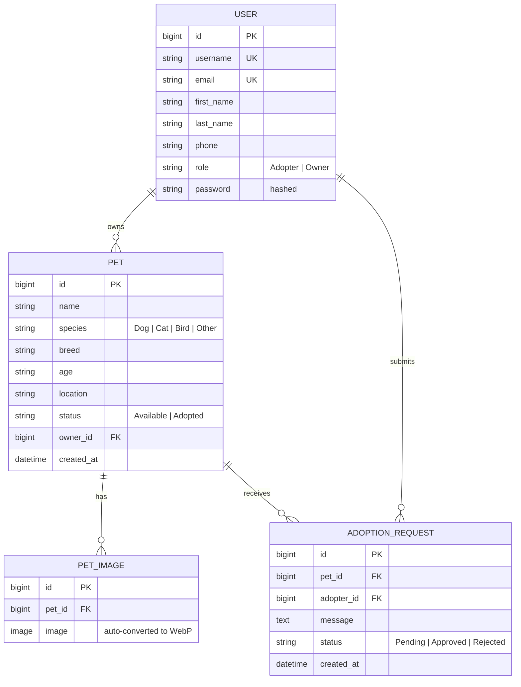

<br>

---

<br>

## 🚀 Getting Started

### Prerequisites

- **Python 3.13+**
- **MySQL 8.0+** *(optional — SQLite works out of the box)*
- **pip** and **virtualenv**

<br>

### 1️⃣ Clone the repository

```bash
git clone https://github.com/<your-username>/petconnect_platform.git
cd petconnect_platform
```

<br>

### 2️⃣ Create and activate a virtual environment

<details open>
<summary><b>Windows (PowerShell)</b></summary>

```powershell
python -m venv myenv
.\myenv\Scripts\Activate.ps1
```

</details>

<details>
<summary><b>macOS / Linux</b></summary>

```bash
python3 -m venv myenv
source myenv/bin/activate
```

</details>

<br>

### 3️⃣ Install dependencies

```bash
pip install -r requirements.txt
```

<br>

### 4️⃣ Configure environment variables

Create a `.env` file in the project root:

```env
# ── Core ──────────────────────────────────────
SECRET_KEY=your-generated-secret-key-here
DEBUG=True
ALLOWED_HOSTS=127.0.0.1,localhost
CSRF_TRUSTED_ORIGINS=

# ── Database ──────────────────────────────────
# True  → MySQL     False → SQLite
USE_MYSQL=True
DB_NAME=petconnect_db
DB_USER=root
DB_PASSWORD=your-db-password
DB_HOST=localhost
DB_PORT=3306

# ── Email (SMTP) ──────────────────────────────
EMAIL_HOST_USER=your-email@gmail.com
EMAIL_HOST_PASSWORD=your-gmail-app-password
```

> 🔑 **Generate a secret key:**
> ```bash
> python -c "from django.core.management.utils import get_random_secret_key; print(get_random_secret_key())"
> ```

> 📧 **Gmail note:** use a [Gmail App Password](https://support.google.com/accounts/answer/185833), not your account password.

<br>

### 5️⃣ Set up the database

```bash
python manage.py migrate
python manage.py createsuperuser
```

<br>

### 6️⃣ Run the development server

```bash
python manage.py runserver
```

🎉 Open **http://127.0.0.1:8000** in your browser.

<br>

---

<br>

## ⚙️ Environment Variables

| Variable | Required | Default | Description |
|:--|:--:|:--|:--|
| `SECRET_KEY` | ✅ | — | Django cryptographic signing key |
| `DEBUG` | ❌ | `False` | Enables debug mode and media serving |
| `ALLOWED_HOSTS` | ❌ | `127.0.0.1,localhost` | Comma-separated allowed hostnames |
| `CSRF_TRUSTED_ORIGINS` | ❌ | *(empty)* | Comma-separated trusted origins |
| `USE_MYSQL` | ❌ | `False` | `True` → MySQL, `False` → SQLite |
| `DB_NAME` | ❌ | `petconnect_db` | MySQL database name |
| `DB_USER` | ❌ | `root` | MySQL username |
| `DB_PASSWORD` | ❌ | `root` | MySQL password |
| `DB_HOST` | ❌ | `localhost` | MySQL host |
| `DB_PORT` | ❌ | `3306` | MySQL port |
| `EMAIL_HOST_USER` | ❌ | *(empty)* | SMTP sender address |
| `EMAIL_HOST_PASSWORD` | ❌ | *(empty)* | SMTP app password |
| `STATICFILES_BACKEND` | ❌ | `StaticFilesStorage` | Set to `whitenoise.storage.CompressedManifestStaticFilesStorage` in production |
| `LOG_LEVEL` | ❌ | `INFO` | Logging level for the `petcare` logger |

<br>

---

<br>

## 🗺️ URL Reference

| Method | Endpoint | Name | Access |
|:--|:--|:--|:--:|
| `GET` | `/` | `index` | 🌍 Public |
| `GET` | `/about/` | `about` | 🌍 Public |
| `GET` | `/browse-pets/` | `browse_pets` | 🌍 Public |
| `GET` | `/pet/<id>/` | `pet_detail` | 🌍 Public |
| `GET · POST` | `/register/` | `register` | 🌍 Public |
| `GET · POST` | `/login/` | `login` | 🌍 Public |
| `POST` | `/logout/` | `logout` | 🔒 Auth |
| `POST` | `/pet/<id>/adopt/` | `adopt_pet` | 🔒 Auth |
| `GET` | `/my-requests/` | `my_requests` | 🔒 Adopter |
| `GET · POST` | `/dashboard/` | `dashboard` | 🔒 Owner |
| `POST` | `/dashboard/pet/delete/<id>/` | `delete_pet` | 🔒 Owner |
| `POST` | `/dashboard/request/<id>/<action>/` | `update_request_status` | 🔒 Owner |
| `POST` | `/api/forgot-password/` | `api_forgot_password` | 🌍 Public |
| `GET · POST` | `/password-reset/` | `password_reset` | 🌍 Public |
| `GET · POST` | `/reset/<uidb64>/<token>/` | `password_reset_confirm` | 🌍 Public |
| `GET` | `/admin/` | — | 🛡️ Staff |

<br>

---

<br>

## 👥 User Roles

<table>
<tr>
<th width="50%">🐾 Adopter</th>
<th width="50%">🏠 Pet Owner</th>
</tr>
<tr>
<td valign="top">

- Browse all available pets
- Filter by species category
- View detailed pet profiles
- Submit adoption requests
- Track request status
- Manage account & password

</td>
<td valign="top">

- List pets for adoption
- Upload multiple pet photos
- View dashboard statistics
- Receive adoption requests
- Approve or reject requests
- Manage listed pets

</td>
</tr>
</table>

<br>

---

<br>

## 🧪 Testing

```bash
python manage.py test petcare
```

The suite covers authorisation boundaries (role gating, object-level ownership,
IDOR protection), the full adoption workflow, account creation and login, and
template rendering.

```
Ran 37 tests — OK
```

<br>

---

<br>

## 🗺️ Roadmap

- [ ] **Edit pet listings** — update details after publishing
- [ ] **Favorites / wishlist** — save pets to revisit later
- [ ] **In-app messaging** — direct chat between adopter and owner
- [ ] **Advanced search** — filter by age range, location, and breed
- [ ] **Email notifications** — alerts on request status changes
- [ ] **REST API** — Django REST Framework endpoints for a mobile client
- [ ] **Arabic localization** — full RTL support
- [ ] **Dark mode** — theme toggle across the platform

<br>

---

<br>

## 🤝 Contributing

Contributions are what make the open-source community such an amazing place to learn and create. Any contributions you make are **greatly appreciated**.

1. **Fork** the project
2. Create your feature branch — `git checkout -b feature/AmazingFeature`
3. Commit your changes — `git commit -m 'Add some AmazingFeature'`
4. Push to the branch — `git push origin feature/AmazingFeature`
5. Open a **Pull Request**

<br>

---

<br>

## 📄 License

Distributed under the **MIT License**. See [`LICENSE`](LICENSE) for more information.

<br>

---

<br>

## 👨‍💻 Author

<div align="center">

**Mona Alakras**

[](https://github.com/)
[](https://linkedin.com/)
[](mailto:monaalakhars00@gmail.com)

</div>

<br>

---

<br>

<div align="center">

### 🐾 Every adoption changes two lives — yours and theirs.

**If this project helped you, consider giving it a ⭐**

<br>

<sub>Built with Mona Alakras ❤️ using Django</sub>

</div>
